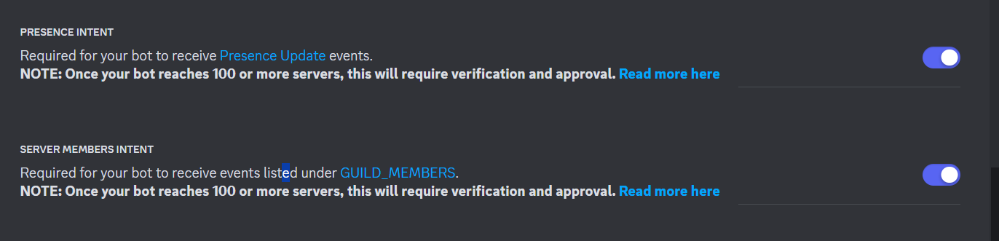

# Disnake Auto Role

Бот для выдачи авто ролей при захоте на сервер

## Настройка

**ВАЖНО!** У бота обязательно должны быть включены

- PRESENCE INTENT
- SERVER MEMBERS INTENT



В коде:

```python
intents.presences = True
intents.members = True
```

### Так же замените `TOKEN` в `main.py`

---

id сервера и id роли для выдачи храняться в `client.db` (он появиться после первого запуска бота)

### `/auto_role role: disnake.Role`

Устанавливает авто роль

_В качестве аргумента `role` вам предложат указать роль с сервера_

_Чтобы убрать авто роль просто не указывайте роль_
